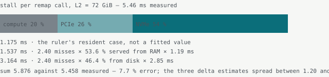
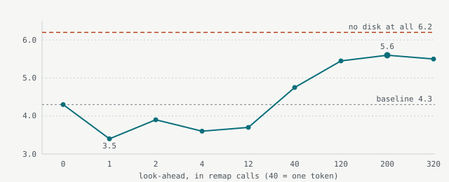

# DeepSeek-V4.1-Flash on One RTX 5090

*Technical report, 10–11 September 2026.*

Porting a 552B-parameter mixture-of-experts model (40 layers, 384 experts, a 189 GiB n-gram
memory) to a llama.cpp fork and running it on a single RTX 5090 with 31.8 GiB of VRAM (a 32 GB card) and 125.7 GiB
of RAM. What is proven, what is measured, what remains — including the estimates made along the way
that the measurements overturned.

| | |
|---|---|
| **Fit for use as the V4.1 engine** | Yes. Five correctness checks passed (section 1); V4 still runs on the same fork; every configuration choice measured. |
| **Fit for publication** | Yes, with five findings of general value (the q-norm defect, the fp8 floor method, the routing-as-switch measurement, the engram prefetch, the rollback fix). The speculative prefetch queue built for the experiments stays off by default. |

| **5.12** tokens/s, new content | **21.27** tokens/s, resident content | **0.9967** logit correlation vs. reference at 1 401 tokens | **6.2** tokens/s, the ceiling without disk misses |
|---|---|---|---|

Code: the [`dsv41-porte` branch](https://github.com/JigSawPT/llama.cpp/tree/dsv41-porte) of llama.cpp
(31 commits on top of b10269, +2 161 lines across the port). Models:
[DeepSeek-V4.1-Flash-GGUF](https://huggingface.co/JigSawPT/DeepSeek-V4.1-Flash-GGUF) (target, 502 GB
in 11 shards) and
[DeepSeek-V4.1-Flash-DSpark-GGUF](https://huggingface.co/JigSawPT/DeepSeek-V4.1-Flash-DSpark-GGUF)
(draft head, 8 GB). Every number on this page names the tool that produced it; the tools are in
[`tools/`](tools/) and the raw results in [`results/`](results/). Units: memory capacities in GiB
(the card's 32 GB is 31.8 GiB usable), file sizes in GB, as the tools report them.

## Contents

1. [How the model runs here](#how-the-model-runs-here)
2. [Correctness: one real defect, then the floor](#correctness-one-real-defect-then-the-floor)
3. [Speed: where the token goes](#speed-where-the-token-goes)
4. [The deficit is in the graph, not the queue](#the-deficit-is-in-the-graph-not-the-queue)
5. [Speculative decoding with the model's own draft head](#speculative-decoding-with-the-models-own-draft-head)
6. [Recommended configuration, and what not to do](#recommended-configuration-and-what-not-to-do)
7. [Every experiment, and what came of it](#every-experiment-and-what-came-of-it)
8. [Method notes](#method-notes)

## How the model runs here

The weights do not fit in the machine: 269 GiB of routed experts, 189 GiB of engram tables, a few
GiB of everything else, against 31.8 GiB of VRAM and 125.7 GiB of RAM. Three things make it run:

- **Expert streaming.** The fork's `--moe-stream` path keeps a cache of expert weights in VRAM
  (18 GiB here) and a second, larger tier in pinned RAM (72 GiB here, the *host tier*, `--moe-stream-l2`),
  and reads everything else from the NVMe as the router asks for it. Once per layer per token, a
  *remap call* brings the six experts that layer chose into the VRAM cache; that call is where
  the token's time goes, and "stall per remap call" is the quantity most of this report measures.
- **The engram on disk.** DeepSeek-V4.1 adds a conditional memory: two hash tables of 384 million
  rows each, indexed by n-grams of the token ids, read a few dozen rows per token. They are
  memory-mapped, never loaded, and read by the host.
- **Two ways to compare with the truth.** Before the port existed, the vendor's reference
  implementation (Python, TileLang kernels) was made to run on the same card with a two-tier
  expert cache written for it — the *probe* below. It served as the numerical reference for the
  port, and as the first speed number (4.3–4.7 tokens/s).

Speed is measured with one benchmark throughout: four prompts of mixed content (a short
question, a code task, Portuguese prose, a reasoning puzzle), three rounds each, on a resident
`llama-server`, decode rate taken between the first and the last streamed piece
(`tools/bench_server.py`). Where a number comes from elsewhere, the text says so.

## Correctness: one real defect, then the floor

Layer-by-layer bisection against the reference implementation showed layer 0 receiving an exact
input and returning a divergent output. A new `--dump` option in the fork's `llama-logits` tool
writes any node the graph already names, with no extra instrumentation. Two sub-steps in, the
culprit was `q`:

| sub-step | correlation | norm, port | norm, reference |
|---|---:|---:|---:|
| `qr_norm` | 0.999912 | 40.015 | 40.034 |
| `q` | **0.949370** | **181.019** | **375.363** |

**181.019 is √(64 × 512) to the last digit.** Only one thing gives a 64-head vector that norm:
every head at RMS 1. The port applied a per-head RMS norm to `q` after `wq_b` — V4 does that; V4.1
does not. The line came with the `deepseek4.cpp` inheritance and never failed anything: shapes
match, the model loads, the text is fluent. The norm is now gated on the architecture, not removed
— V4 runs on this fork and there is no V4 reference at hand to verify it there.

| first-step logits, 5 tokens | before | after |
|---|---:|---:|
| correlation vs. reference | 0.761 | **0.927** |
| layer 39 | 0.7802 | **0.9031** |
| argmax | equal | equal |

### What remains is not a defect, and its size is known

The remaining gap had been compared against an invented ideal of 0.999. The reference runs its
linear layers in fp8 with 32×32 blocks and ue8m0 scales, and quantizes its own activations. The
floor was measured at each site (`tools/fp8_floor.py`, `tools/kv_floor.py`):

| what the reference rounds and the port does not | round-trip correlation | relative error |
|---|---:|---:|
| one fp8 linear (`wq_a`) | 0.999896 | 1.45 % |
| window KV, fp8 block 32 | 0.999613 | 2.80 % |
| compressed latent, fp4 block 16 | 0.994630 | **10.39 %** |
| indexer q and k, fp4 block 32 | 0.987746 | **15.64 %** |

The port measures 0.999912 at the point where the floor of one linear is 0.999896: it is already
at the floor. The more precise side of the pair is the port — Q8_0 attention against fp8 e4m3, and
MXFP4 experts that are bit-for-bit identical (repack verified on 480/480 blocks). That does not make
it better: the model was trained with these roundings, and a more precise port is a different model.
Only a quality benchmark can settle that.

### The amplifier is the MoE gate

At layer 2 the shared expert and the routed experts receive the same input and run the same
arithmetic. The shared expert loses 0.0022 of correlation; the routed path loses **0.0304**.
Fourteen times more, because one of them chooses. Measured over all 40 layers
(`tools/routing_switch.py`): **208 of 240 experts agree (86.7 %)**, and the gap between the 6th
and 7th routing score is about 1 % — the order of an fp8 linear's error. **The gate is a switch,
not an adder.** Token-for-token equality over a long generation is not attainable, and that is
architecture, not implementation.

### At long context the port is as close to the reference as to itself

At 1 401 tokens the indexer makes real choices (700 compressed positions against a top-k of 512)
— the short test never exercised it. No steps at layer 2 or layer 20, equal argmax, top-6 in the
same order. And the number that closes the question (`tools/compare_dumps.py`):

| at 1 401 tokens | layer 39 | logits |
|---|---:|---:|
| port vs. **itself** (two runs) | 0.975181 | 0.995852 |
| port vs. **the reference** | 0.975907 | 0.996671 |

The divergence from the reference is indistinguishable from zero. The port is not reproducible
above roughly 1 024 tokens — the divergence enters at layer 2 — and the cause is pinned: with one
I/O thread, two runs are bit-for-bit identical. Expert-cache slot assignment depends on I/O timing,
which changes the accumulation order inside `mul_mat_id`, and the routing amplifies it.
`--moe-stream-io-threads 1` gives reproducibility on demand (3.6 instead of 4.3 tokens/s) — the
right mode for A/B quality tests at long context.

Those are the five checks: weights identical (the MXFP4 repack), routes identical up to the
measured margin, per-layer numbers at the reference's own rounding floor, long-context logits as
close to the reference as to a second run, and a correct engram hash (384/384 indices).

## Speed: where the token goes

The benchmark on the port, with the model resident in a `llama-server`:

| | decode | time to first token |
|---|---:|---:|
| **cold** — content seen for the first time | **5.12 tokens/s** | 8.56 s |
| **resident** — the same prompt again | **21.27 tokens/s** | 0.27 s |
| the reference implementation with the probe's cache, for comparison | 4.34–4.67 | 29 s |

The second row is not an artefact: with greedy decoding, repeating the prompt generates the same
tokens, which touch the same experts, which are already resident. The server's cold misses stop at
8 906 and never climb again. **21.27 tokens/s is the compute ceiling, measured.** A common
benchmark convention — discard the first request as warm-up and keep the rest — would publish
20.1 tokens/s here, four times what a conversation sees: that convention was written for models
where the start-up cools, not the content.



*The host tier was swept from 0 to 72 GiB with the VRAM cache fixed; the VRAM hit rate stayed
invariant (62.74 %) across the sweep, which is what makes the decomposition legitimate
(`tools/stall_decomposition.py`).*

| ceiling | tokens/s | how |
|---|---:|---|
| today, host tier of 72 GiB | 4.3 | the host-tier sweep |
| perfect look-ahead of 5 tokens | **5.6** | the prefetch oracle, measured (next section) |
| no disk misses at all | 6.2 | decomposition; the oracle gets within 2 % of it |
| everything resident in VRAM | 21.3 | unreachable: a 105 GiB working set against 31.8 GiB of VRAM |

> **Earlier estimate:** "with an efficient I/O path this reaches 20 tokens/s."
> **Measured:** the real ceiling of this architecture on this machine is 6.2 tokens/s. The 21.3
> figure requires the working set in VRAM. Everything between 6.2 and 21.3 is PCIe, which is only
> removed by already having the expert on the card.

## The deficit is in the graph, not the queue

The NVMe delivers **10.04 GB/s** at the queue depth decode produces (6) and 11.42 GB/s at depth 16,
measured with the real access pattern (`tools/disk_physical_io.py`). The port extracts **4.33**.
Sweeping I/O threads from 1 to 18 moves throughput from 3.6 to 4.2 tokens/s and then nothing: four
workers suffice, because there are only **3.78 disk requests in flight per layer** — a layer's 18
requests can only leave after that layer's router has run, and the queue fills and drains 40 times
per token. No thread pool invents requests that do not exist yet.

> **Earlier estimate:** "the disk is saturated; one route forward is a faster NVMe."
> **Measured:** 43 % of what the disk already delivers is used. The saturation claim was inferred
> from the rate the disk was delivering, without checking the rate it can deliver.

### Perfect knowledge of the future pays — at a depth no predictor reaches

If the engine knew which experts the next tokens will route to, it could fetch them early. To
measure what that is worth before building any predictor, a speculative queue was added to the
streaming path: it fills only the host tier, drains only when the demand queue is empty, and is fed
by a recorded trace of the run itself — an oracle with perfect knowledge. A multi-agent adversarial
code review (68 agents, five failure dimensions, three sceptics per finding) caught seven defects
in it — three of which corrupted the readings — and after the fixes the curve looks like this:



*Two runs per point; the line joins the means. Peak at 200 calls: stall 4.13 ms against the 4.04 ms
predicted for "no disk at all".*

**+30 % at the peak, five tokens ahead.** The decomposition predicted where the curve would stop:
it said the stall without disk misses would be 4.04 ms; measured at 200 calls, 4.13 ms. The same
curve rules out a layer-level predictor (one that guesses the next layer's routing from the
current hidden state): the depths such a predictor can reach (1, 2, 4 calls) cost **−19 / −7 /
−16 %**, because the speculative read is still in flight when the demand arrives and is paid
twice. The gain lives at one token or more of look-ahead, and only knowing the future tokens gets
there — which is speculative decoding.

### Block verification with a perfect draft: +17–20 %, and no more

Processing a known continuation in blocks of K tokens is verifying K tokens with full acceptance —
the best case of speculative decoding, without a draft model. Prompt of 431 tokens:

| K | 1 | 2 | 4 | 8 | 16 | 32 |
|---|---:|---:|---:|---:|---:|---:|
| tokens/s | 4.6 | 5.2 | **5.4** | 5.3 | **5.5** | 5.4 |

A plateau from K = 4. The union of experts over K tokens grows almost linearly at small K — routing
concentration only bites near saturation — and at K ≥ 8 the experts per layer exceed the 25 cache
slots and the multi-pass path kicks in. The consequence for speculative decoding on this machine:
its value comes almost entirely from tokens accepted per step, not from cheap verification.

### The one place where look-ahead works without a predictor

The engram addresses are computed from token ids, not from the hidden state — they are known the
instant the token exists. The input routine read 56 rows per token, one at a time, on the thread
the graph was waiting for. Two passes — the first only hashes and cannot miss; between the two, the
whole list goes to the OS through `PrefetchVirtualMemory` — and:

| | ms per token | µs per row |
|---|---:|---:|
| before | 10.437 | 188.1 |
| **after** | **0.917** | **16.5** |

**11.4×**, 4.3 → 4.5 tokens/s, and the 16.5 µs agree with the 17.3 µs the disk tool measured at
queue depth 8 by another route. Exact: the layer-1 capture is taken after that layer's engram and
is bit-for-bit identical before and after.

## Speculative decoding with the model's own draft head

V4.1 ships a DSpark draft head: three full V4.1 blocks under `mtp.*` (128 routed experts, 3 used),
a Markov bigram head of rank 256, a confidence head, and blocks of five tokens. The fork's
`--spec-type draft-dspark` path already ran the V4 head; what it lacked was the V4.1 semantics — no
per-head q norm, the hyper-connection mix (V4's multi-stream residual) threaded one sub-layer
ahead, and a final collapse with the last FFN mix rather than dedicated `hc_head` weights. A new
converter class exports the head (78 tensors, 7.97 GB) and a `dsv41_semantics` key tells the
loader which rules apply. The head loads, generates correct text, and reports its own acceptance
(`tools/bench_dspark.py`; draft experts in RAM so the target keeps its 18 GiB cache and the control
is the same target):

| draft length | case | acceptance | tokens/s, cold | Δ | tokens/s, resident | Δ |
|---|---|---:|---:|---:|---:|---:|
| **2** | verbatim repetition | 97.1 % | **5.12** | **+12 %** | **8.34** | **+15 %** |
| **2** | code with explanation | 81.9 % | 4.45 | +1 % | **5.02** | **+12 %** |
| 3 | verbatim repetition | 97.4 % | 4.98 | +9 % | 7.77 | +7 % |
| 3 | code with explanation | 71.1 / 62.6 % | 4.44 | +1 % | 4.45 | −1 % |
| 5 (trained block) | verbatim repetition | 93.3 % | 4.92 | +7 % | 7.48 | +3 % |
| 5 (trained block) | code with explanation | 69.5 / 48.6 % | 4.39 | 0 % | 4.15 | −8 % |
| control, same server without the draft | | | 4.58 / 4.39 | | 7.24 / 4.49 | |

Those two prompts are the mechanism's best and worst case. The benchmark — four prompts of mixed
content, three rounds each, same day, same configuration — is the number that counts:

| benchmark, draft of 2 | acceptance | cold, control | cold, draft | Δ | resident, control | resident, draft |
|---|---:|---:|---:|---:|---:|---:|
| short | 61 % | 4.87 | 4.74 | −3 % | 23.30 | 21.91 |
| code | 79 % | 4.70 | 5.07 | +8 % | 20.22 | 21.62 |
| Portuguese prose | 51 % | 5.55 | 4.77 | **−14 %** | 22.74 | 19.88 |
| reasoning | 74 % | 5.39 | 5.61 | +4 % | 20.55 | 20.98 |
| **median** | | **5.13** | **4.92** | **−4 %** | **21.40** | **21.23** |

Two further checks closed the same way: a confidence threshold (`--spec-draft-p-min` 0.5 / 0.8)
moves the code case by less than the noise, and putting the draft's experts on the card instead of
in RAM (target cache 13 GiB, control at the same 13) changes nothing while costing 5 GiB of target
cache.

**The head works; on this machine it does not pay.** Acceptance is high and tracks the content
(51 % on Portuguese prose, 97 % on verbatim repetition), but the throughput follows it only where
acceptance is very high. The reason is the block-verification result above seen from the other
side: a verification step pays for the union of experts of its K + 1 tokens, and that union grows
almost linearly at small K. At the trained block of 5, a step that accepts 5.67 tokens costs about
5.3 single-token steps and the gain vanishes; at a draft of 2 the accepted length (2.0–2.9) barely
covers the cost, so each prompt lands within ±14 % of the control according to its own acceptance,
and the benchmark's median is −4 %. The mechanism is not at fault: in a compute-bound regime, where
a batched verification is nearly free, the same acceptance would multiply throughput. That regime
needs the working set on the card, which this model does not allow on 31.8 GiB. The export stays; the
default configuration does not use it.

The same measurement exposed a real gap in the fork: the recurrent-state rollback of the V4 cache
(`n_rs_seq`) was only enabled for model-based drafts, so any n-gram draft rejected tokens it could
not undo and the next batch arrived with inconsistent positions. Fixed in the rule
(`need_n_rs_seq`), not in the example. With rollback on, the n-gram draft (`llama-lookup`) is null
in the best case (+2 %) and −33 % on realistic content: it proposes little when it is right and
much when it is wrong, and every wasted verification pays the expert union of the block.

**Exactness under speculation.** Greedy speculative decoding reproduces the control text token for
token on the verbatim case in both runs. On the code case the resident runs agree for 341
characters and then differ on a formatting choice (backticks around a literal) — a near-tie in the
routing, the same switch effect measured above, exposed by the different batch shape of a
verification step.

## Recommended configuration, and what not to do

```
--moe-stream --moe-stream-cache 18 --moe-stream-l2 72   # default I/O threads; no expert pinning
--reasoning off                                          # chat; thinking mode at temperature 0 loops on vague requests
--moe-stream-io-threads 1                                # only when bit-for-bit reproducibility is needed
-md DeepSeek-V4.1-Flash-DSpark.gguf --spec-type draft-dspark --spec-draft-n-max 2 --spec-draft-n-cpu-moe 3
                                                         # optional: the model's own draft head; neutral on mixed content
```

| lever | status | why |
|---|---|---|
| host tier above 72 GiB | worse | 88 GiB gives 3.9–4.1: it steals page cache from the engram tables, and the tier's own hit rate rises while throughput falls |
| VRAM cache 13 → 22 GiB | flat | hit rate 59 → 66 %, throughput 4.3 across the range: more VRAM removes PCIe misses, not disk misses, and disk is 54 % |
| pinning the 7 hottest experts in VRAM (the fork's JigSaw feature) | null | three independent measurements; at 72 GiB everything fits and there is nothing to pin |
| cache eviction policy | 0 % | LRU, LFU, heat, random and the optimal MIN/Belady policy give the same misses at 72 GiB (`tools/cache_oracle.py`) |
| more RAM | does not help | the working set grows with the content (26 new experts per token in the tail; 105 GiB at 128 tokens) |
| 2-bit experts, skipping layers | unnecessary | bytes are not the bottleneck; declining them costs no speed |
| faster NVMe | unnecessary | 43 % of the available bandwidth is used |
| encoder-only prefill | not exact | V4.1 is a causal encoder-decoder: its 20 encoder layers could in principle process the prompt alone, worth 23.9 % of prefill bytes; but the receptive field of the 19 sliding windows requires the decoder on the last 2 432 positions, below that the exact saving is zero, and the reference does not implement it |
| DSpark draft head, draft of 2 | neutral | benchmark −4 % cold, 0 % resident; −14 to +8 % per prompt, tracking 51–79 % acceptance; +12–15 % only on verbatim repetition |

> **Earlier estimate:** "VRAM is under-used."
> **Measured:** VRAM is at 87.4 % during a run (27.8 of 31.8 GiB), and its size is irrelevant across
> the whole configurable range. The line `projected to use 8863 MiB` excludes the expert cache,
> which is allocated after the fit test.

## Every experiment, and what came of it

The work followed a written plan: first the reference implementation with a cache (the probe),
then the port, then a list of hypotheses for speed. Everything in it has an answer; the negative
answers are kept because each one closes a door.

| experiment | outcome |
|---|---|
| Kernel utilisation of the reference implementation | the batch-1 expert GEMM ran at 5.2 % of the card's bandwidth; llama.cpp's `mul_mat_id` delivers 72 % — this is why the port was worth doing |
| Twelve defects in the probe's cache | all fixed, all exact: 3.37 → 4.34–4.67 tokens/s on the reference implementation |
| Fusing the gate and up projections | exact, gives nothing: the kernel was not the limit |
| More residency on the probe | +0 % and +0.5 % in two experiments: its I/O wait was already hidden under compute |
| MXFP4 conversion | a bijection, 480/480 blocks byte-identical |
| The port | runs; nine architectural differences from V4 fixed, then the q-norm |
| Host-tier sweep (0 → 88 GiB) | optimum at 72; 88 is slower |
| The benchmark on the port | 5.12 cold, 21.27 resident |
| Cache eviction policy | 0 % margin between LRU and the optimal policy at 72 GiB |
| Physical vs. logical disk reads | 86.7 % of what the process asks for reaches the disk |
| Where the missing bandwidth is | 3.78 disk requests in flight per layer; the graph serialises, not the queue |
| Prefix cache | already delivered by the server: 32× on time to first token |
| Prefetch oracle | +30 % at 5 tokens of look-ahead; negative at 1–4 remap calls |
| Layer-level routing predictor | recall 70.9 % at 6, but the oracle curve shows the depth it reaches loses; not built |
| Token decomposition | 20 % compute, 26 % PCIe, 54 % NVMe; ceilings 4.3 / 6.2 / 21.3 |
| Engram prefetch | 11.4×, exact |
| Encoder-only prefill | not exact below 2 432 tokens; not implemented by the reference; closed |
| Non-determinism above 1 024 tokens | cause found (I/O-timing slot assignment); one I/O thread makes it bit-exact |
| Block verification with a perfect draft | +17–20 %, plateau from K = 4 |
| n-gram draft | null best case, −33 % realistic; exposed and fixed the rollback gap |
| DSpark draft head | exported; acceptance 51–97 %; neutral on the benchmark; best draft length 2 |
| Freeing the draft head's 7.4 GiB for the cache | moot: cache size is flat across the range |
| 2-bit experts, layer skipping, fp4 KV | not attempted: they change the model, and bytes are not the bottleneck |
| Split GGUF | 11 shards load and answer identically to the monolithic file |

## Method notes

- **A number that contradicts one already measured indicts the instrument first.** The routing
  probe reported 1.7 % because it read a ggml view linearly; the real value is 86.7 %.
- **A hypothesis must not evaluate itself.** The speculative queue's probe used the cache's own
  `find()`, which counts a hit and sets the CLOCK bit — inflating the statistic it was about to be
  judged by.
- **Before attributing a difference to a change, measure two runs with no change at all.** Three
  times in one night; three wrong conclusions avoided.
- **Repeating the prompt does not warm the engine — it warms the answer.** The "discard the first
  request" convention measures the cache on models whose residency depends on the content.
- **"The disk is not the limit" is a conclusion about an engine, not about a model.** The
  reference implementation spent 20 % of the token on disk; the port spends 94 %.
- **Measure the floor before calling a gap a defect.** Every remaining divergence from the
  reference sits at the rounding floor of the reference's own fp8/fp4 arithmetic.
- **The draft length is a property of the machine, not the model.** The trained block of 5 is the
  optimum on 8×H800, where verification is nearly free; on a disk-bound machine the optimum is 2.
  Sweep before publishing, and publish the sweep.

Longer working notes, including the negative results in full, are in [`docs/NOTES.md`](docs/NOTES.md).

## Credits

DeepSeek for the model and the reference implementation (MIT). nibor1896 for
[Crow](https://github.com/nibor1896/Crow), whose expert-streaming patch series the fork builds on
(MIT). ggml-org/llama.cpp. Engineering assisted by Claude (Anthropic).
